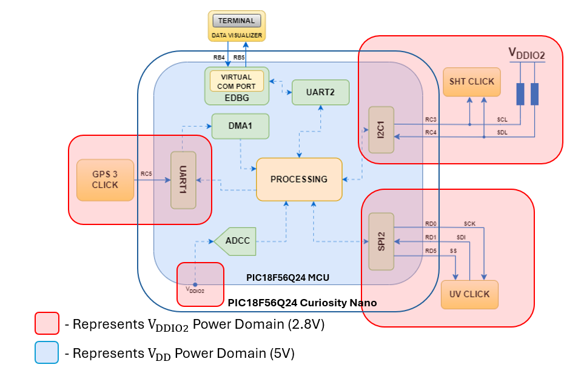
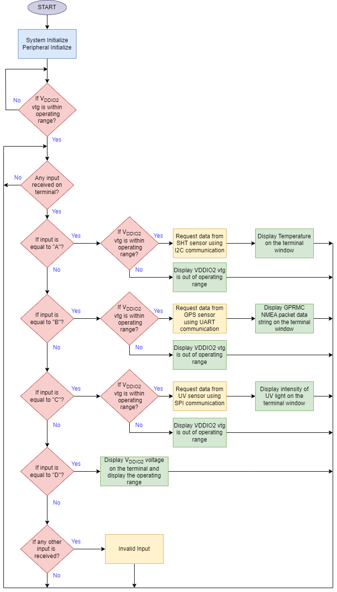
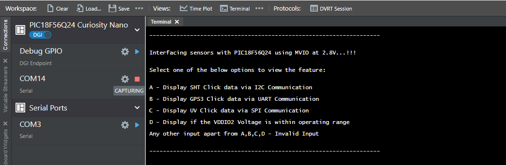
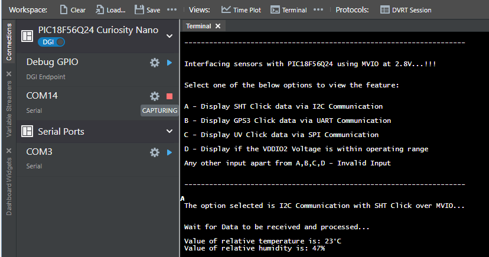
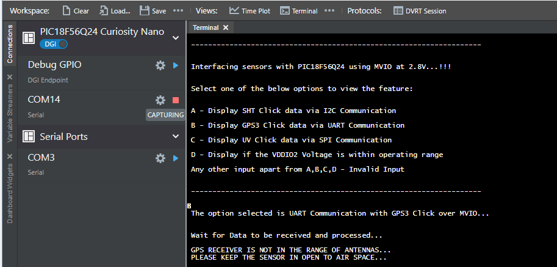
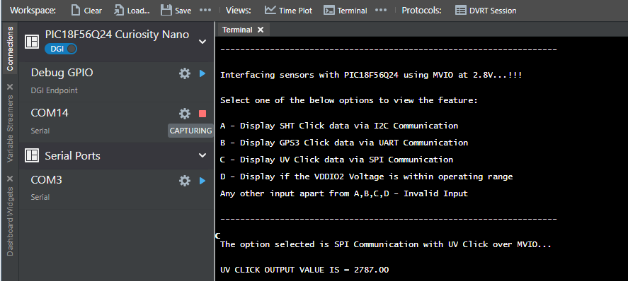
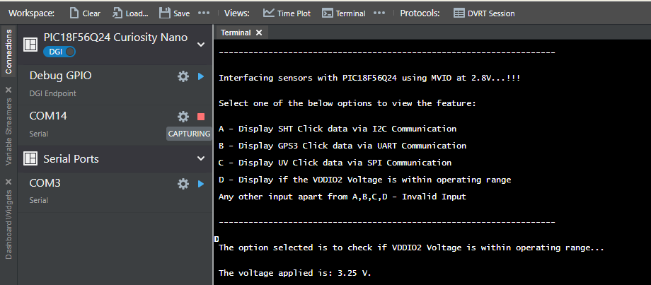
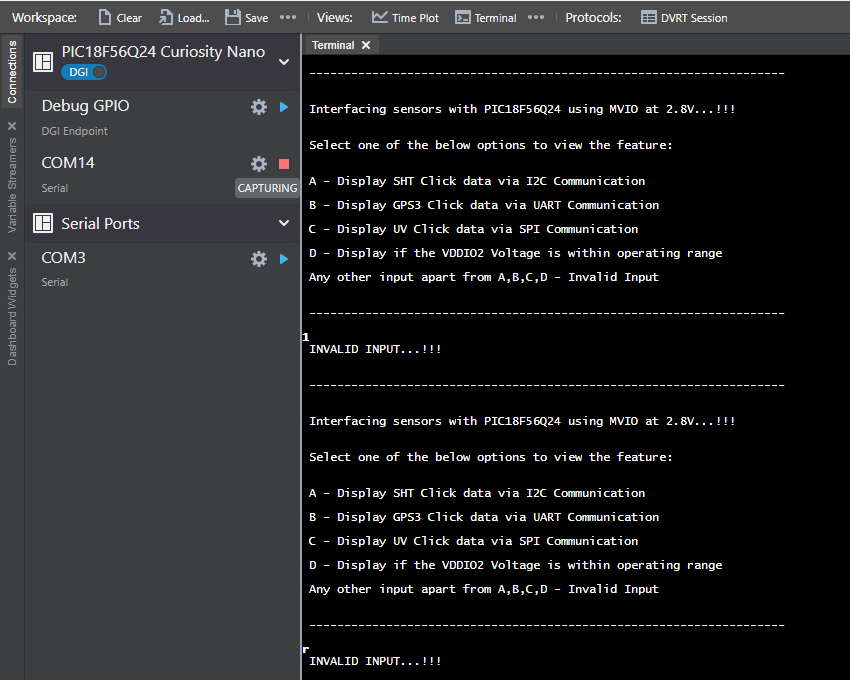

<!-- Please do not change this logo with link -->

<a target="_blank" href="https://www.microchip.com/" id="top-of-page">
   <picture>
      <source media="(prefers-color-scheme: light)" srcset="images/mchp_logo_light.png" width="350">
      <source media="(prefers-color-scheme: dark)" srcset="images/mchp_logo_dark.png" width="350">
      
   </picture>
</a>

# Interfacing External Sensor Modules with PIC18F56Q24 Microcontroller using MVIO

The PIC18-Q24 microcontroller family is available for various real-time, sensor interfacing applications showcases a wide range peripheral support. This family of microcontrollers particularly focuses on Multi-Voltage I/O (MVIO) interface with multiple I/O pins powered by an alternative VDD pin, Enhanced Code Protection features to provide increased security to the firmware and data, 10-bit Analog-to-Digital Converter with Computation (ADCC) capable of 300 ksps and along with these features it also has support for the traditional communication interfaces like Universal Asynchronous Receiver-Transmitter (UART) with support for asynchronous, Serial Peripheral Interface (SPI) and Inter-Integrated Circuit (I2C).

The code example intends to showcase the usage of Multi-Voltage I/O (MVIO) interface of PIC18-Q24 microcontroller family, which allows a subset of the I/O pins to be powered by a different I/O voltage domain i.e., VDDIO2. Thereby, the MVIO feature eliminates the need for having external level shifters when interfacing the microcontroller with external ICs, operating at a different supply voltage, through a serial communication interface.  In this code example, the MVIO pins are configured as serial communication (I2C, SPI and UART) lines for communication with external sensor modules that operate at a different voltage than the PIC18F56Q24 device.

## Related Documentation

* [Getting Started with Multi-Voltage I/O (MVIO)](https://ww1.microchip.com/downloads/en/Appnotes/GettingStarted-MVIO-AVRDB-DS90003287A.pdf)
* [PIC18F56Q24 Product Page](https://www.microchip.com/en-us/product/pic18f56q24)
* [PIC18F56Q24 Data Sheet](https://ww1.microchip.com/downloads/aemDocuments/documents/MCU08/ProductDocuments/DataSheets/PIC18F26-45-46-55-56Q24-Microcontroller-Data-Sheet-XLP-DS40002503.pdf)
* [PIC18F56Q24 Code Examples on MPLAB Discover](https://mplab-discover.microchip.com/v2?dsl=PIC18F56Q24)

## Description

The code example uses a UV click, GPS click and SHT click, which communicate with the PIC18F56Q24 microcontroller using SPI, UART and I2C communication interfaces, respectively. These click boards are powered by a 2.8V supply, and the PIC18F56Q24 microcontroller is powered by a 5V supply. However, the microcontroller pins with MVIO interface capability, used for interfacing the click boards, are powered by 2.8V through the VDDIO2 pin. The block diagram below shows an overview of the various microcontroller peripherals used in this code example and the pins configured for interfacing with the click boards. The data visualizer tool is used to interact with users, accept user inputs and transmit them to the microcontroller over a UART interface. Additionally, it is used to display the data requested by the user on its terminal window.

In this code example, the application firmware continuously monitors the supply voltage on the VDDIO2 pin of the microcontroller and checks for valid user input if the voltage detected on the VDDIO2 pin is within the permissible operating voltage range of the click boards. Based on the received user input, the application requests data from the respective click board, through the serial communication interface and displays the received data on the terminal window of the data visualizer tool. If the voltage detected on the VDDIO2 pin is outside the recommended operating voltage of the click boards, then the application prompts the user to supply a recommended voltage on the VDDIO2 pin. Similarly, if the user-entered input data is invalid, then the application prompts the user to input valid data.

  
   Figure 1: Block Diagram 

## Software Used

This application uses MPLAB® X IDE compiler and graphical code generator to provide an easy and hassle-free user experience.

The following tools are used for this demo application:

* [MPLAB® X IDE](https://www.microchip.com/mplab/mplab-x-ide) v6.20 or newer
* [XC8 compiler](https://www.microchip.com/mplab/compilers) v2.46 or newer
* [MPLAB® Code Configurator(MCC)](https://www.microchip.com/mplab/mplab-code-configurator) v5.7.1 or newer
* [MPLAB® Data Visualizer 1.3.1665](https://www.microchip.com/en-us/tools-resources/debug/mplab-data-visualizer) or newer
* [Microchip PIC18F-Q Series Device Support](https://packs.download.microchip.com) 1.25.433 or newer
* [Data Visualizer](https://www.microchip.com/en-us/tools-resources/debug/mplab-data-visualizer) v1.3.1665 or newer
* ADCC MCC Melody Driver 1.0.6
* SPI MCC Melody Driver 1.2.0
* DMA Driver 1.1.1
* I2C Driver 6.1.2
* UART Driver 1.10.0
* MVIO Driver 1.0.0

## Hardware Used

* [PIC18F56Q24 Curiosity Nano board](https://www.microchip.com/en-us/development-tool/EV01E86A")
* [Curiosity Nano base for Click boards](https://www.microchip.com/developmenttools/ProductDetails/AC164162)
* [GPS3 Click](https://www.mikroe.com/gps-3-click)

The GPS 3 Click board provides users with positioning, navigation, and timing features. This Click board is interfaced with the microcontroller using the UART interface.

  
   Figure 2: GPS3 Click Board 

* [SHT Click](https://www.mikroe.com/sht-click)

The SHT Click is a compact board for high reliability and long-term stability for measuring humidity and temperature, which uses the [SHT31-DIS](https://sensirion.com/products/catalog/SHT31-DIS-B/) sensor. This Click board is interfaced with the microcontroller using the I2C interface.

  
   Figure 3: SHT Click Board 

* [UV Click](https://www.mikroe.com/uv-click)

The UV Click board is used for sending an alert to the users indicating excessive ultraviolet (UV) radiation levels. This Click board is interfaced with the microcontroller using the SPI interface.

  
   Figure 4: UV Click Board 

* Female-Female Jumper cables 

## Hardware Setup

The PIC18F56Q24 Curiosity Nano and Curiosity Nano Base for Click Boards are used as a development platform. The Curiosity Nano Base board is used to interface the UV, GPS3 and SHT Clicks with the PIC18F56Q24 microcontroller using the mikroBUS slots 1, 2 and 3 respectively.

  
   Figure 5: Hardware Setup 

## Pin Connections

In this code example, the click boards along with the MVIO pins of PIC18F56Q24 microcontroller, which are used for serial communication, are supplied with 2.8V through VDDIO2 pin and by using an external bench power supply. The table below shows the necessary connections between the PIC18F56Q24 microcontroller and the click boards. As explained in the table below, connect the PIC18F56Q24 Curiosity Nano board and Click boards using female-female jumper wires.

| Signal Description                                                                                 | MCU Pin  | Click Board Pin Description | Sensor Details             |
|----------------------------------------------------------------------------------------------------|----------|-----------------------------|----------------------------|
| SPI2 (SS)                                                                                          | RD1      | SS                          | UV Click mikroBUS Slot-1   |
| SPI2 (MISO/SDI)                                                                                    | RD1      | MOSI                        | UV Click mikroBUS Slot-1   |
| SPI2 (SCK)                                                                                         | RD0      | SCK                         | UV Click mikroBUS Slot-1   |
| UART1 (RX)                                                                                         | RC5      | TX                          | GPS3 Click mikroBUS Slot-2 |
| I2C1 (SCL)                                                                                         | RC3      | SCL                         | SHT Click mikroBUS Slot-3  |
| I2C1 (SDA)                                                                                         | RC4      | SDA                         | SHT Click mikroBUS Slot-3  |
| UART2 (RX)                                                                                         | RB4      | -                           | -                          |
| UART2 (TX)                                                                                         | RB5      | -                           | -                          |
| LED                                                                                                | RF2      | -                           | -                          |
| Pin provides power to the MVIO pins. Supply 2.8V to this pin using an external power supply source | VDDIO2   | -                           | -                          |

**Note:**
- *The Curiosity Nano Base Board can supply either 3.3V or 5V to the three mikroBUS slots through its power supply circuitry. Since it is not possible to power the click boards with 2.8V using the Curiosity Nano Base board power circuitry, isolate the 5V and 3.3V pins on the click boards from the Curiosity Nano Base board power circuitry, by removing these male pins from the pin header of the click boards*
- *Supply 2.8V to the click boards and VDDIO2 pin of the microcontroller through an external power supply and using female-female jumper wires*

## Demonstration Setup

The application firmware is developed on a PIC18F56Q24 microcontroller and generated using MCC Melody and MPLAB X IDE. The implemented firmware runs on the PIC18F56Q24 Curiosity Nano development board. The microcontroller peripherals, SPI, UART, I2C, DMA, ADCC, and MVIO are used to implement the functions of the code example. These peripherals, which are configured as part of the peripheral initialization, do not require any changes to their configuration during the run-time.

The SPI peripheral is configured as Host with a 2 MHz clock, used to interface with the UV Click to receive environmental UV radiation data. The I2C peripheral is configured in Standard Mode (100 kHz), used to interface with the SHT Click to receive temperature and relative humidity data. The UART1 peripheral instance is used to interface with the GPS3 Click to receive positioning and navigation data. The data received on UART1 Receive register (U1RXB) is stored in a temporary buffer using the DMA module. The ADCC peripheral is configured in Basic mode with Fosc as clock source and “VDDIO2/10” is selected as its positive input channel, used to monitor voltage on the VDDIO2 pin. The UART2 peripheral instance is used to input data from users via the terminal window of the data visualizer tool.

The below figure shows the firmware flow of the code example.

  
   Figure 6: Firmware Flowchart 

## Details for Communication with Click Boards

### Communication with SHT Click

The raw data received from the sensor is then converted to human understandable data using below formulae.

  
   Figure 7: Data Conversion Formulae 

where, SRH and ST represent the raw Relative Humidity and Temperature.

### Communication with GPS3 Click

In this code example, only GPRMC commands are considered. The respective bitfields are explained using an example as given below.

225446         : Time of fix 22:54:46 UTC
A              : Navigation receiver warning A = OK, V = warning
4916.45,N      : Latitude 49 deg. 16.45 min North
12311.12,W 	   : Longitude 123 deg. 11.12 min West
000.5	 	   : Speed over ground, Knots
054.7          : Course Made Good, True
191194         : Date of fix  19 November 1994
020.3,E        : Magnetic variation 20.3 deg East
*68            : Mandatory checksum

### Communication with UV Click

The data captured by the sensor is displayed in its raw form and is verified if it falls in the UV acceptable range of defined thresholds.

## Microcontroller Peripheral Configuration

| Peripherals               | Configuration                                                                                                                                                                                                                                                                                                                                                                                                  | Usage                                                                         |
|---------------------------|----------------------------------------------------------------------------------------------------------------------------------------------------------------------------------------------------------------------------------------------------------------------------------------------------------------------------------------------------------------------------------------------------------------|-------------------------------------------------------------------------------|
|    Clock Control   	 |Clock source –   HFINTOSC HF Internal Clock – 64 MHz Clock Divider   – 1  Active Clock Tuning Update: Enabled                                                                                                                                                                                                                                                                                                        |    System  clock                                                                     |
|    ADCC	|Operating Mode: Basic Mode  Result Alignment: right Positive Reference: VDD Negative Reference: VSS Positive Input Channel: VDDIO2_by_10 Clock Source: FOSC  Clock source Fosc Clock Divider: FOSC/30 ADC Clock: 2.133 MHz | Used for monitoring VDDIO2 voltage|
|UART1		|  Requested Baudrate: 9600 Enable Receive: Enabled   |   Used for receiving GPS sensor Data    |                                                              
|UART2		| Requested Baudrate: 9600  Redirect printf to UART: Enabled Enable Transmit: Enabled Enable Receive: Enabled   | Used for sending and receiving data from terminal
|	 DMA1		  |    Start Trigger: U1RX Abort Trigger: Software Interrupt Source Region: SFR  Source Module: UART1 Source SFR: U1RXB Source Message Size: 1 Destination Region: GPR Destination Variable: destinationbuffer Destination Size: 512 Destination Mode: incremented Destination Message Size: 512 Interrupt Driven: Enabled DMA Destination Count Interrupt: Enabled	|Used for saving the GPS data in a local buffer|																																																										
| I2C| Clock Source: Fosc Fast Mode: Standard Mode Requested Speed: 100 kHz Interrupt Driven: Enabled | Used for sending commands and receiving data from SHT sensor|
| SPI	| Requested Speed: 2 MHz Mode: Mode 0 Data Input Sampled At: Middle Clock Source: HFINTOSC Clock Frequency: 64 MHz 			| Used for receiving data from UV sensor|
| MVIO| I/O Monitor Enable: Enabled Hysteresis Enable: Enabled LVD Trip point selection: disabled| Used for supplying the VDDIO2 voltage to the microcontroller|

## Operation

1.	Interfacing sensors with PIC18F56Q24 using MVIO pins demonstration needs input from the user in the form of number to perform the defined functionality. The user gets an option to select input to provide respective functionalities depending on the input provided as seen in the firmware flowchart.
2.	The hardware connections are made as shown in the Hardware Setup. Power up the Curiosity Nano Adapter board using micro USB cable and provide external power to the MVIO pins via VDDIO2.
3.	Download the firmware available from the GitHub page link.
4.	Build the project using the latest version of tools as mentioned in the Software Tools section and load the generated hexadecimal file to the PIC18F56Q24 microcontroller.
5.	After running the program, the user will observe the default screen as shown in the below image.

  
   Figure 8: Default Output Screen 

6.	The output will be displayed as shown in the below image if the user enters ‘A’.

  
   Figure 9: I2C Sensor Output 

7.	The output will be displayed as shown in the below image if the user enters ‘B’.
 

  
   Figure 10: UART Sensor Output 

8.	The output will be displayed as shown in the below image if the user enters ‘C’.

  
   Figure 11: SPI Sensor Output 

9.	The output will be displayed as shown in the below image if the user enters ‘D’.

  
   Figure 12: V,sub>DDIO2 Operating Voltage Output 

10.	The output will be displayed as shown in the below image if the user enters anything other than the provided inputs.

  
   Figure 13: Invalid Input 

Note: 
*The input provided by the user are not case sensitive, so both upper and lower case are accepted as valid inputs.*

## Conclusion

The code example demonstrates the usage of the MVIO feature of the PIC18-Q24 microcontroller family by configuring these pins as serial communication pins for communication with external sensor modules, powered at a different voltage (Vsub>DDIO2) than the operating voltage supplied to PIC18F56Q24 microcontroller, without the need for an external level shifter. The integrated MVIO interface of PIC18-Q24 family greatly helps in reducing the BOM cost of end products by eliminating the need for an on-board level shifter IC.
